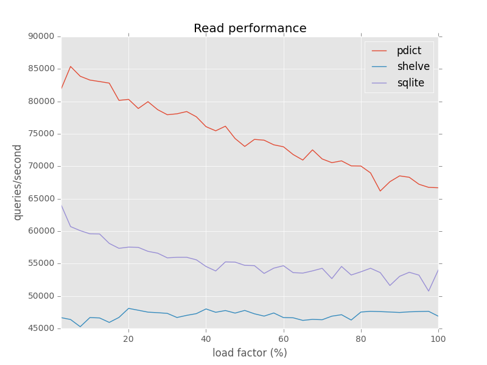
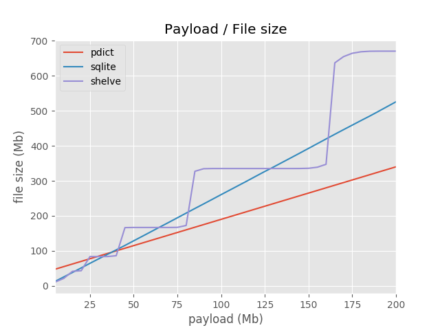

pdict
=====

Pdict is a light-weight implementation of persistent dictionary designed to store large collections
of key-value pairs for fast lookup.
As such, it has a bunch of useful properties, such as [fast reads](#reads), [space-efficient file format](#file-size) and
support for json objects.

Pdict works with Python 2 and 3.


Minimal usage example:

``` python
>>> import pdict
>>> 
>>> db = pdict.create('geo.db', capacity=10)
>>> db['new york'] = (40.7141667, -74.0063889)
>>> db['new york']
(40.7141667, -74.0063889)
>>> db.close()
```

Implementation
--------------
On a technical side, the dictionary is implemented on top of a chained hash table.
The table is statically allocated at initialization time and won't extend as data come in.
It means that the approximate size of data should be known beforehand to keep load factor sane.

Dictionary keys and value are serialized using library [messagePack](http://msgpack.org/).
Its key advantages over [pickle](https://docs.python.org/3/library/pickle.html)
are compact binary representation, speed and security.
MessagePack, however, supports only JSON objects.

Install
-------

``` bash
$ git clone git@github.com:AleksTk/pdict.git
$ cd pdict
$ python setup.py install
$ python -m unittest pdict.tests.test_pdict
```

Limitations
-----------
* deletions are not supported
* reads and writes are not thread-safe
* maximum file size is 4.2Gib
* key/value length up to 64Kib
* no data recovery mechanisms

Usage Examples
--------------

``` python
>>> import pdict
>>>
>>> # create a dictionary, add some data
>>> db = pdict.create('geo.db', capacity=10)
>>> db['new york'] = (40.7141667, -74.0063889)
>>> db['tallinn'] = (59.4369600,24.7535300)
>>> len(db)
2
>>> db.capacity
10
>>> db['new york']
(40.7141667, -74.0063889)
>>>
>>> list(db.keys())
['new york', 'tallinn']
>>>
>>> db.close()
>>>
>>> # open existing dictionary
>>> db = pdict.Pdict('geo.db')
>>> db['new york']
>>> (40.7141667, -74.0063889)
```


Benchmarks
----------

Environment:
  
    Python 2.7.6
    Debian Linux Mint 17.3 64-bit
    Intel i5-3210M CPU @ 2.50GHz x 2, 2.3Gib RAM

### Reads




### File size


